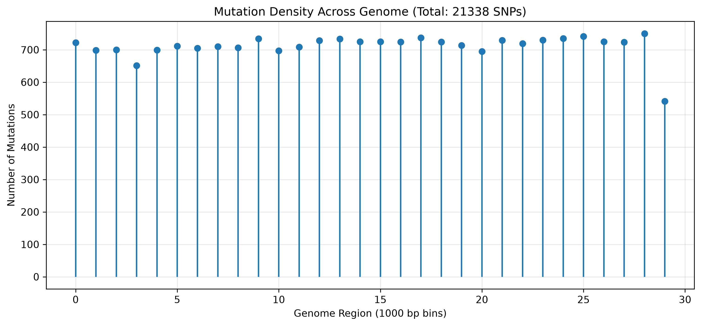

# 🧬 SARS-CoV-2 Genome Mutation Tracker

A Python-based bioinformatics project that compares the Wuhan SARS-CoV-2 reference genome with a variant genome using **position-by-position nucleotide comparison** to identify sequence variations, classify mutation types, and visualize mutation density.

> **Note:** This project is intended for educational purposes and demonstrates basic genome comparison techniques. It does **not** implement full biological sequence alignment.

---

## 📊 Key Results

| Metric | Value |
| :--- | :---: |
| Wuhan Genome Length | **29,903 bp** |
| Variant Genome Length | **29,740 bp** |
| Total SNPs Identified | **21,338** |
| Transitions | **6,896** |
| Transversions | **14,442** |
| Ts/Tv Ratio | **0.48** |
| Genome Length Difference | **163 bp** |

---

## 📈 Mutation Density Graph



*Figure: Mutation density across the SARS-CoV-2 genome in 1,000 bp bins.*

---

## 🧪 Methodology

1. Load the Wuhan reference and variant genomes from FASTA files using **Biopython**.
2. Compare both genomes position-by-position up to the length of the shorter sequence.
3. Ignore ambiguous nucleotides (`N`).
4. Detect nucleotide mismatches (SNPs).
5. Classify mutations as:
   - **Transitions:** A↔G, C↔T
   - **Transversions:** A↔C, A↔T, G↔C, G↔T
6. Calculate the **Transition/Transversion (Ts/Tv) ratio**.
7. Calculate the overall genome length difference.
8. Bin mutations into **1,000 bp** intervals.
9. Export results as text and CSV files.
10. Generate a mutation density graph using Matplotlib.

---

## 📋 Sample Mutations

```text
Position 2 : T → G
Position 3 : T → A
Position 4 : A → T
Position 5 : A → C
Position 6 : A → T
Position 8 : G → T
Position 10: T → C
Position 12: A → C
Position 15: C → A
Position 16: C → A
Position 17: T → C
Position 18: T → G
Position 19: C → A
Position 20: C → A
Position 22: A → T
Position 23: G → T
Position 24: G → T
Position 25: T → A
Position 28: C → A
Position 29: A → T
```

---

## ⚠️ Limitations

This project uses **direct position-by-position comparison** rather than a biological sequence alignment algorithm.

- Corresponding positions in both genomes are assumed to represent the same biological location.
- Insertions or deletions (indels) can shift downstream positions, causing additional mismatches after the first structural variation.
- Genome length differences are reported as an overall length difference rather than aligned gaps.
- Therefore, the reported mutations represent **positional differences** and should not be interpreted as results from a full sequence alignment.

---

## 🚀 Future Improvements

- Implement the **Needleman–Wunsch** global alignment algorithm.
- Support gap-aware sequence comparison.
- Compare multiple SARS-CoV-2 variants.
- Annotate mutations by viral genes (Spike, ORF1ab, N, etc.).
- Build an interactive web interface for genome comparison.

---

## 📂 Project Structure

```text
Genome_Mutation_Tracker/
│
├── main.py
├── README.md
├── mutation_graph.png
├── requirements.txt
│
├── data/
│   ├── Wuhan.fasta
│   └── datavariant.fasta
│
└── results/
    ├── mutation_report.txt
    └── mutation_report.csv
```

---

## 🚀 How to Run

### 1. Clone the repository

```bash
git clone https://github.com/jeganudhaya2007-ops/Genome_Mutation_Tracker.git
cd Genome_Mutation_Tracker
```

### 2. Install dependencies

```bash
pip install biopython matplotlib
```

### 3. Run the analysis

```bash
python main.py
```

---

## 📤 Output Files

| File | Description |
|------|-------------|
| `mutation_report.txt` | Summary statistics and sample mutations |
| `mutation_report.csv` | Complete list of detected SNPs |
| `mutation_graph.png` | Mutation density visualization |

---

## 🛠️ Technologies Used

- Python 3.13
- Biopython
- Matplotlib
- Git
- GitHub

---

## 📚 What I Learned

This project helped me gain practical experience in:

- Python programming
- Bioinformatics workflows
- FASTA sequence processing with Biopython
- Mutation analysis
- Scientific data visualization
- Git and GitHub version control
- Technical documentation

---

## 👨‍💻 Author

**Jegan Udhaya**

1st Year B.Tech Biotechnology Student  
Bannari Amman Institute of Technology

🔗 GitHub Profile:  
https://github.com/jeganudhaya2007-ops

🔗 Repository:  
https://github.com/jeganudhaya2007-ops/Genome_Mutation_Tracker

---

## 📝 License

This project is intended for educational and portfolio purposes.

---

## ⭐ Support

If you found this project useful, consider giving it a ⭐ on GitHub.

Feedback and suggestions are always welcome!